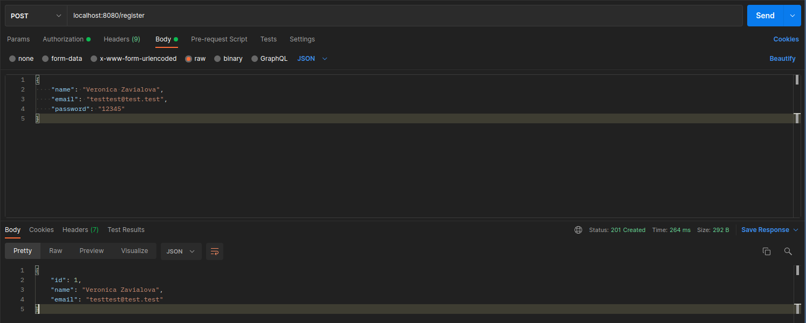
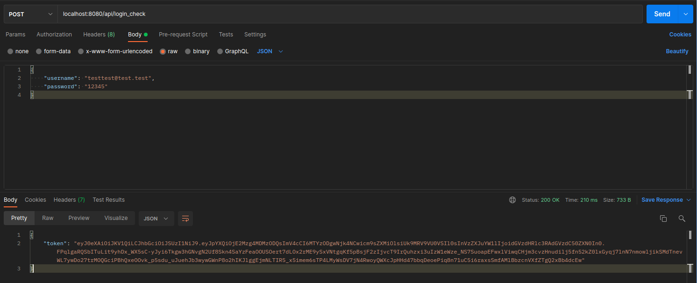
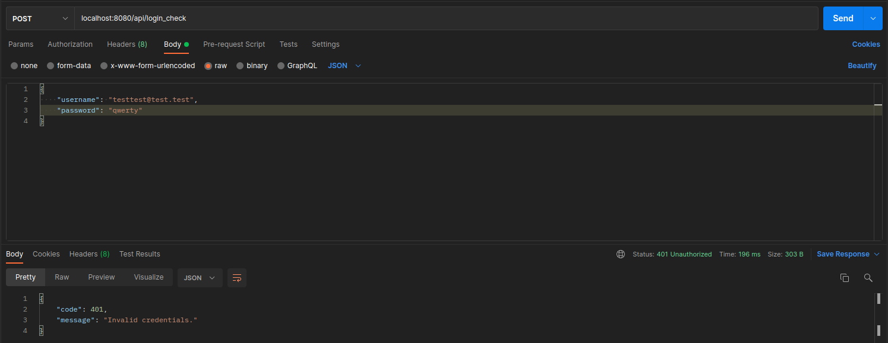
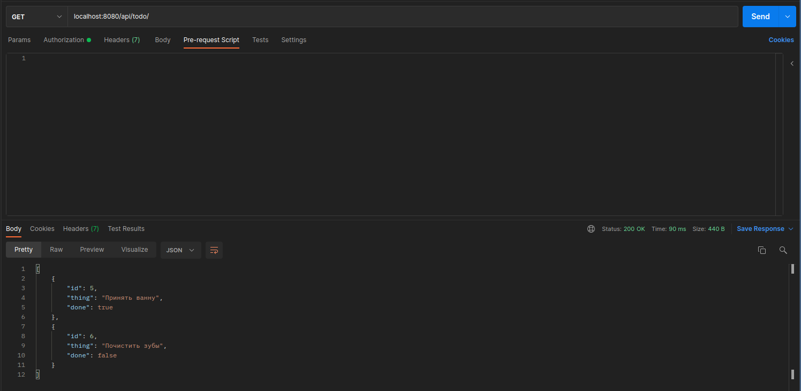
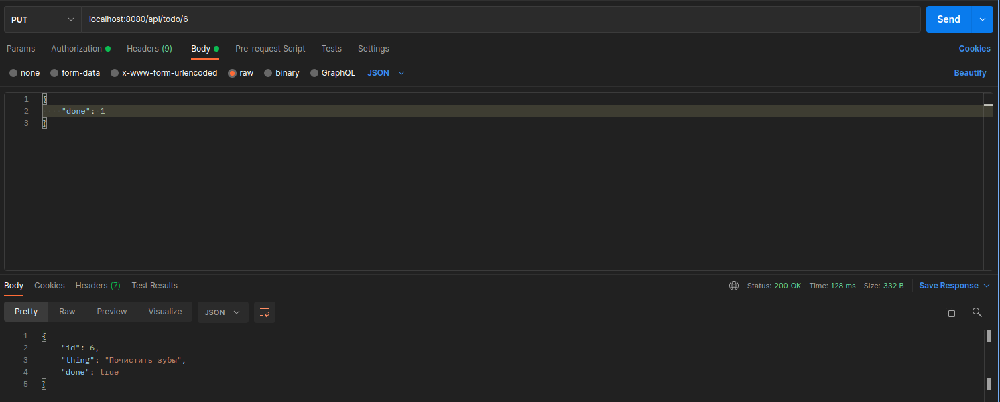
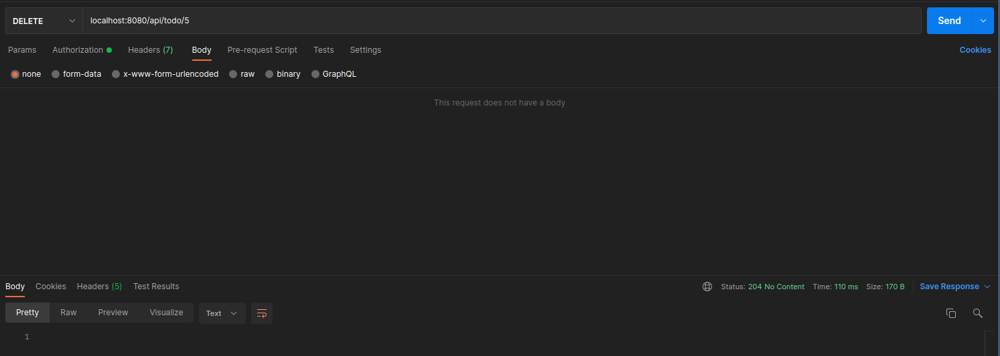
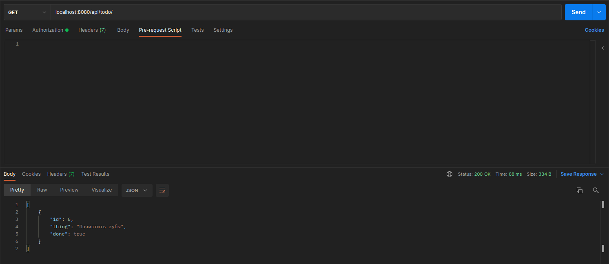

# todo-list
Web-приложение, позволяющее регистрироваться в системе и управлять личным списком задач (TODO-лист).

### POST /register
Тут происходит регистрация пользователя.

### POST /api/login_check
Проверяются введеные пользователем данные, если все ок, выдается токен.

Иначе - ошибка (пользователя нет).

### POST /api/todo/
После успешной авторизации, используя токен, можно добавлять дела в список.

### GET /api/todo/
Также испльзуя токен пользователя, получаем весь список дел.

### PUT /api/todo/{id}
Можно изменить как состояние таска, так и его название.

### DELETE /api/todo/{id}
Удалим один таск.

Тогда в GET /api/todo/ останется только таск на чистку зубов.

